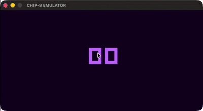

# CHIP-8 Emulator

A chip-8 emulator that is written in C that uses SDL2 for both graphics and keyboard input.




## Features

- CHIP-8 CPU emulation
- 4KB memory
- 16 general purpose registers
- 16 level stack
- delay and sound timers
- 64x32 display
- SDL2 rendering
- keyboard input
- ROM loading

## Supported Instructions
Implemented all of the original chip-8 instruction set.

See [Instruction set](docs/instruction-set.md)

## Controls
The controls depend on the rom you use, but the supported keymap is:

123C - 1234

456D - QWER

789E - ASDF

A0BF - ZXCV


## Building
You need to have SDL2 installed and pkg-config  

```bash
git clone https://github.com/j-milligan7/chippy-chip8-emulator.git
cd chippy-chip8-emulator
make
```

## Running
After building:
```bash
./chip8 roms/yourRom.ch8
```
A good place to get ROMs:
[chip8 archive](https://johnearnest.github.io/chip8Archive/?sort=platform)  

## Architecture
See [Architecture](docs/architecture.md)

## Project Structure
```text
|-src
|  |-main.c
|  |-chip8.c
|  |-chip8.h
|  |-instructions.c
|  |-instructions.h
|  |-display.c
|  |-display.h
|
|-roms
| |- your roms here
|
|-assets
|
|-Docs
|
|-Makefile
|
|-README.md
```


## Testing
See Future Improvements

## Future Improvements (TODO)
Docs 

Debug Mode/Menu

Testing

fix display issues / rewrite display fully


## References
where i got some ROMs to test

[chip8Archive](https://johnearnest.github.io/chip8Archive/?sort=platform)

First test ROM 

[chip8-test-rom](https://github.com/corax89/chip8-test-rom)

The guide i followed

[write-a-chip-8-emulator](https://tobiasvl.github.io/blog/write-a-chip-8-emulator/)

## Ai disclaimer
The display code is Ai generated, i understand this is not a good practice to have and i will be rewriting it later.
